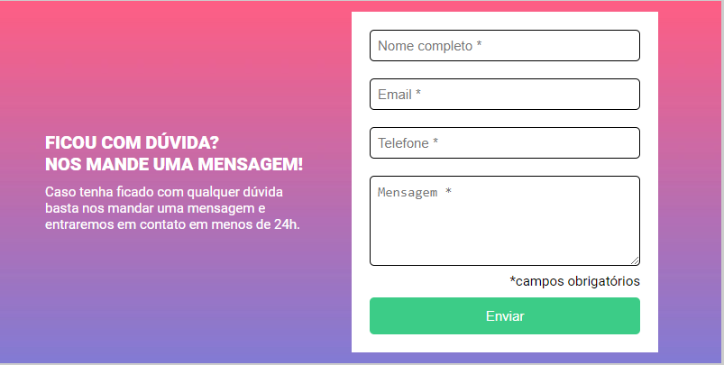
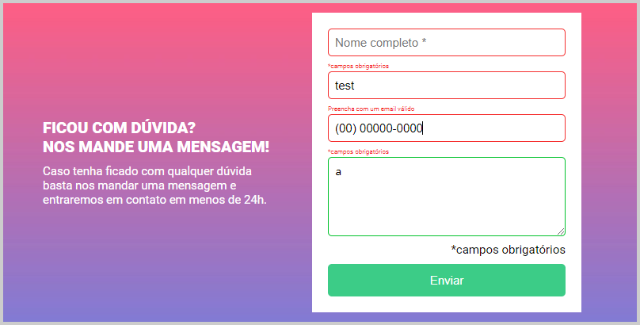

# HMTL + CSS Challenge + JS / Responsive Formulary

This project is a milestone of a FullStack developer course, serving to reinforce foundational principles and then upload it to a GitHub repository.

## Table of contents

- [Overview](#overview)
  - [The challenge](#the-challenge)
  - [Layout](#-layout)
  - [Links](#links)
- [My process](#my-process)
  - [Technologies](#-technologies)
  - [What I learned](#what-i-learned)
- [Author](#author)

## Overview

### The challenge

Users should be able to:

- Users are able to enter information into the designated input fields. Upon submitting, the fields should dynamically update, incorporating a label to indicate any required information.


### 🔖 Layout

Challenge Layout:
https://www.figma.com/file/zBKnYG9UNdUiIr8ClQTWSG/DESAFIO---HTML%2FCSS%2FJS-INTERMEDI%C3%81RIO?node-id=13%3A99&mode=dev

<div align="center">
    <p>Default Layout:</p>
    
</div>

<div align="center">
    <p>Submit Layout:</p>
    
</div>

### Links

- Solution URL: [GitHub Repo](https://github.com/bigodrigo/responsive-formulary)
- Live Site URL: [GitHub Page](https://bigodrigo.github.io/responsive-formulary)

## My process

### 🚀 Technologies

- Semantic HTML5 markup
- CSS custom properties
- Flexbox
- Form Handling
- String Manipulation for Mask Format

### What I learned

I have previous experience working on projects involving JavaScript and form manipulation using [yup](https://www.npmjs.com/package/yup). In this project, I explored various HTML functions such as "required," "submit," and manipulating the document. While I usually remove older code, for this particular project, I kept a test CSS and JS for comparison purposes. The background image also presented a unique challenge as I typically use cover or non-repeating backgrounds, whereas in this case, the goal was to repeat the image horizontally. I am particularly proud of the additional details I implemented that were not part of the original challenge. For example, I developed a mask for required email formats and implemented a mask for telephone numbers that automatically inserts symbols as the user types.

```js
    if ((input.id === 'email' && !validateEmail(input.value)) || (input.id === 'telefone' && !validatePhone(telefoneInput.value))) {
    label.innerHTML = `Preencha com um ${input.name} válido`;
    label.style.visibility = 'visible';
    input.classList.add('input-vazio');
    input.classList.remove('input-preenchido');
    }
```

```js
    function validateEmail(email) {
    const emailRegex = /^[^\s@]+@[^\s@]+\.[^\s@]+$/;
    return emailRegex.test(email);
    }

    function validatePhone(phone) {
    const phoneRegex = /^\+?\d{0,2}\s?\(?\d{2}\)?\s?\d{4,5}-?\d{4}$/;
    return phoneRegex.test(phone);
    }

    function formatTelefone() {
        const telefoneValue = telefoneInput.value.replace(/\D/g, '');
        if (telefoneValue.length <= 2) {
            telefoneInput.value = telefoneValue;
        } else if (telefoneValue.length <= 7) {
            telefoneInput.value = `(${telefoneValue.slice(0, 2)}) ${telefoneValue.slice(2)}`;
        } else {
            telefoneInput.value = `(${telefoneValue.slice(0, 2)}) ${telefoneValue.slice(2, 7)}-${telefoneValue.slice(7)}`;
        }
    }
```

## Author

- Portfolio - [Rodrigo](https://portfolio-bigodrigo.vercel.app/)
- GitHub - [bigodrigo](https://github.com/bigodrigo)
- Linkedin - [rodrigo-boquer](https://www.linkedin.com/in/rodrigo-boquer/)
